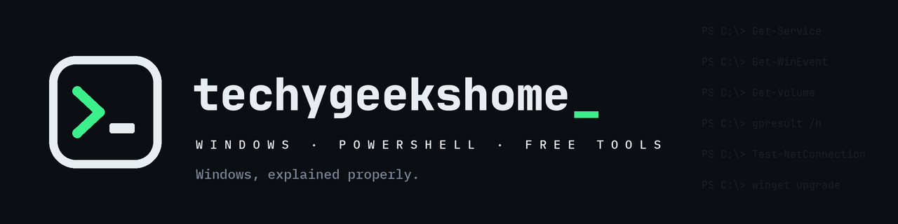

<div align="center">



**Windows, explained properly.** Free Windows tools that each do one job well, plus 750+ guides at [techygeekshome.info](https://techygeekshome.info).

No ads, nothing bundled, no sign-up.

</div>

## Free Windows tools

| App | What it does |
|---|---|
| [AppGeek](https://github.com/techygeekshome/AppGeek) | Update everything on your PC in one run, and install from a curated catalogue. Built on winget. |
| [AuthGeek](https://github.com/techygeekshome/AuthGeek) | Offline two-factor authenticator. Your codes in one encrypted vault on your own machine. |
| [CleanGeek](https://github.com/techygeekshome/CleanGeek) | Recovers real space from caches, temp files and update leftovers. No registry cleaner. |
| [CutGeek](https://github.com/techygeekshome/CutGeek) | Removes photo backgrounds locally, at full resolution, with no watermark. |
| [DiskGeek](https://github.com/techygeekshome/DiskGeek) | Shows what is actually filling a drive, finds duplicates and tracks what grew. |
| [DriverGeek](https://github.com/techygeekshome/DriverGeek) | Every driver on the machine, and the updates Windows Update keeps hidden. |
| [LingoGeek](https://github.com/techygeekshome/LingoGeek) | Offline document translator for Word, PDF, subtitles and text. |
| [PDFGeek](https://github.com/techygeekshome/PDFGeek) | Merge, split, extract, rotate, watermark and password-protect PDFs offline. |
| [ReelGeek](https://github.com/techygeekshome/ReelGeek) | Turns a folder of photos into a vertical reel cut to the beat. |
| [ShortGeek](https://github.com/techygeekshome/ShortGeek) | Turns a script into a narrated, captioned vertical short. |
| [SoundGeek](https://github.com/techygeekshome/SoundGeek) | Removes background noise and hum, and evens out the levels. |
| [TranscribeGeek](https://github.com/techygeekshome/TranscribeGeek) | Turns recordings into text on your own machine. |
| [VideoSizeGeek](https://github.com/techygeekshome/VideoSizeGeek) | Fits a video into an exact size limit for Discord, Gmail or WhatsApp. |
| [MetaRestoreGeek](https://github.com/techygeekshome/MetaRestoreGeek) | Puts dates and locations from a Google Takeout export back into your photos. |
| [Ultimate Settings Panel](https://github.com/techygeekshome/Ultimate-Settings-Panel) | 250+ Windows settings, tools and commands in one searchable panel. |

Browse them all at [techygeekshome.info/geek-tools](https://techygeekshome.info/geek-tools/). Several are in winget:

```powershell
winget search TechyGeeksHome
```

## WordPress

| Project | What it does |
|---|---|
| [NeoDark](https://github.com/techygeekshome/NeoDark) | Fast, dark-mode WordPress theme for tech guides and tutorials. |
| [LinkGather](https://github.com/techygeekshome/LinkGather) | Audit every URL on your site, then filter, sort and export to CSV. |
| [Controlled Draft Publisher](https://github.com/techygeekshome/Controlled-Draft-Publisher) | Publishes drafts automatically on a schedule you control. |
| [BackBurner Post Archiver](https://github.com/techygeekshome/Backburner-Post-Archiver) | Moves old content out of circulation after a set age. |

## Elsewhere

[Website](https://techygeekshome.info) · [YouTube](https://www.youtube.com/@techygeekshome) · [Support on Ko-fi](https://ko-fi.com/techygeekshome)
